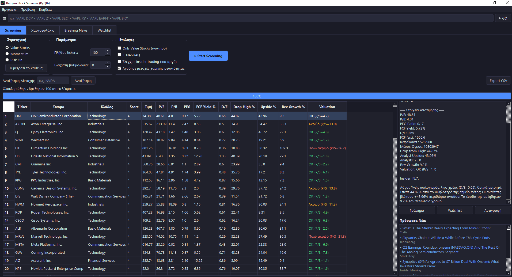
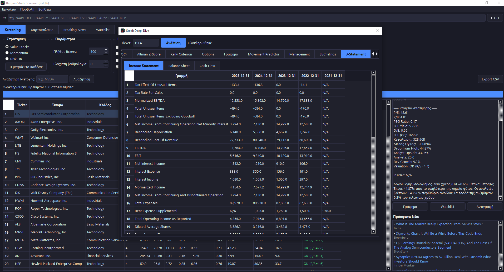
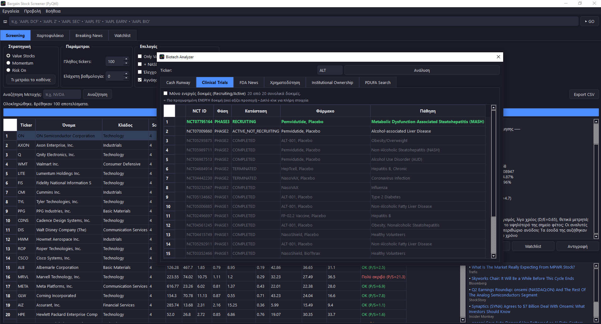
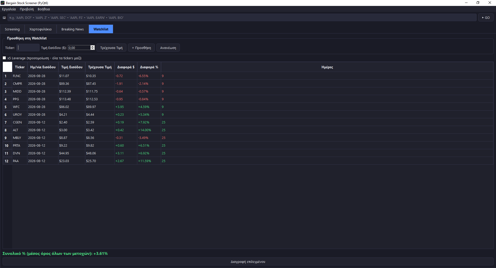

# 📊 Bargain Screener

A desktop stock screening & analysis application built with **Python** and **PyQt6** — a "mini-Bloomberg terminal" combining fundamental screening, technical analysis, options pricing, portfolio optimization, and biotech-specific research tools in a single native Windows app.

> **Note:** This is a commercial product. Source code and executable are not public — this repo showcases the project for portfolio purposes. 

---

## 🖼️ Screenshots






```

---

## What It Does

Bargain Screener scans thousands of stocks against three distinct strategies (value, momentum, small-cap growth), then gives users 25+ dedicated analysis tools to research any candidate in depth — from discounted cash flow models to options-implied market sentiment to biotech clinical trial tracking, all unified behind a single-ticker "Deep-Dive" dashboard.

## Key Features

**Screening Engine**
- 3 scoring strategies (value / momentum / risk-on), parallelized across ~4,700 tickers
- Automatic rate-limit detection & backoff, self-healing blocklist for delisted/invalid tickers
- Historical backtesting to validate whether the scoring model actually predicts returns
- Color-coded valuation/signal/squeeze flags for at-a-glance reading

**Stock Deep-Dive**
- Unified, tabbed dashboard consolidating 12 single-ticker tools (DCF, Altman Z-Score, Options, Chart, SEC Filings, Management, 3-Statement, Movement Predictor, and more) behind one ticker search

**Valuation, Risk & Quant**
- DCF model, Altman Z-Score (color-coded safe/grey/danger zones), custom formula screener
- Options analysis: Black-Scholes Greeks, implied volatility vs. historical, put/call skew, max pain, automatic low-liquidity data-quality detection
- Portfolio optimization (Markowitz, Hierarchical Risk Parity) via `skfolio`
- Kelly Criterion position sizing based on a ticker's own historical return distribution
- Experimental logistic regression movement classifier with honest out-of-sample validation against a naive baseline
- Per-position leverage simulation in Portfolio/Watchlist ("what would I have made with 5x?")

**Research Tools**
- SEC EDGAR filings integration, management/proxy statement lookup
- Biotech-specific suite: clinical trial tracking (ClinicalTrials.gov), cash runway, FDA news, institutional ownership
- Insider cluster-buying detector (+ bulk scanner across Watchlist/Portfolio/S&P 500), sector rotation (RRG) charts
- Commodities dashboard with cross-asset correlation & seasonality analysis

**Engineering**
- Multi-threaded and synchronous background workers tuned for stability across long sessions
- SQLite persistence layer for portfolio, watchlist, alerts, and notes
- Packaged as a standalone Windows executable (PyInstaller / Nuitka)

## Tech Stack

`Python` · `PyQt6` · `pandas` / `numpy` · `matplotlib` · `scikit-learn` · `skfolio` · `yfinance` · `SQLite`

## Author

Athanasios (Sakis) Tolias — [LinkedIn] · [Email]
